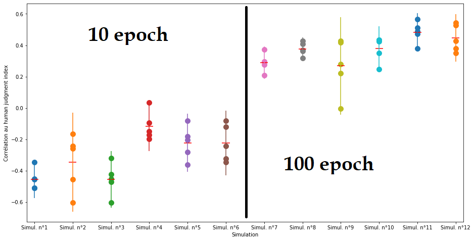
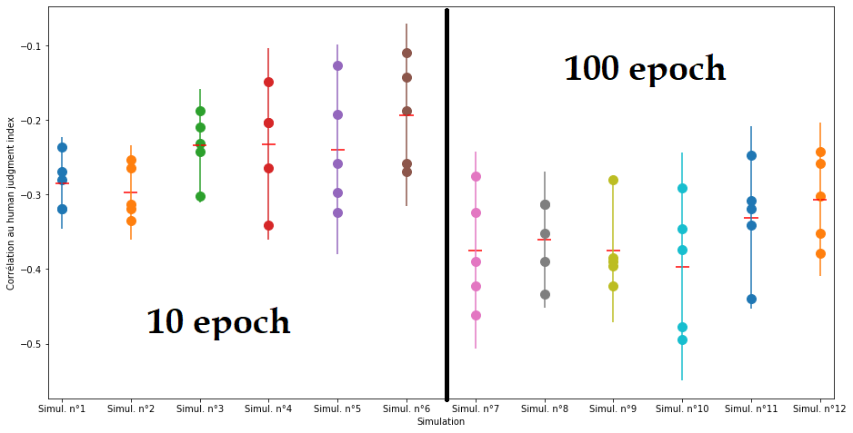

# 1. Modèle AKR

## 1. 100 k tweets

### 1. Variation de la window, learning_rate fixé (=0.01)
dim = 20  
K = 5  
sample = 0.001

*learning_rate = 0.01*

1. *window = 2*  

  **Corr = -0.143**
  
  Évolution sur 10 epochs : -0.0989, -0.1538, -0.2747, -0.2308, -0.2308, -0.1703, -0.2308, -0.2473, -0.1978, -0.1429

2. window = 3  

  **Corr = 0.126**
  
  Évolution sur 10 epochs : '0.159', '0.258', '0.225', '0.104', '0.104', '0.082', '0.082', '0.082', '0.082', '0.126'
|             |   Epoch 1 |   Epoch 2 |   Epoch 3 |   Epoch 4 |   Epoch 5 |   Epoch 6 |   Epoch 7 |   Epoch 8 |   Epoch 9 |   Epoch 10 |
|:------------|----------:|----------:|----------:|----------:|----------:|----------:|----------:|----------:|----------:|-----------:|
| Pas de seed |     0.159 |     0.258 |     0.225 |     0.104 |     0.104 |     0.082 |     0.082 |     0.082 |     0.082 |      0.126 |
| Seed 1      |     0.258 |     0.181 |     0.165 |     0.165 |     0.165 |     0.115 |     0.159 |     0.011 |     0     |      0.181 |
| Seed 5      |     0.621 |     0.621 |     0.621 |     0.632 |     0.593 |     0.615 |     0.626 |     0.632 |     0.632 |      0.588 |
| Seed 10     |     0.066 |     0.071 |     0.071 |    -0.022 |    -0.066 |    -0.132 |    -0.137 |    -0.104 |     0.022 |      0.011 |
| Seed 15     |     0.61  |     0.61  |     0.604 |     0.604 |     0.593 |     0.637 |     0.632 |     0.571 |     0.593 |      0.593 |
| Seed 20     |     0.582 |     0.56  |     0.56  |     0.505 |     0.495 |     0.495 |     0.495 |     0.495 |     0.484 |      0.495 |

Distance euclidienne :

|             |   Epoch 1 |   Epoch 2 |   Epoch 3 |   Epoch 4 |   Epoch 5 |   Epoch 6 |   Epoch 7 |   Epoch 8 |   Epoch 9 |   Epoch 10 |
|:------------|----------:|----------:|----------:|----------:|----------:|----------:|----------:|----------:|----------:|-----------:|
| Pas de seed |    -0.143 |    -0.209 |    -0.253 |    -0.214 |    -0.269 |    -0.28  |    -0.28  |    -0.28  |    -0.258 |     -0.275 |
| Seed 1      |     0.11  |     0.055 |     0.005 |     0.038 |    -0.022 |    -0.011 |    -0.088 |    -0.11  |    -0.088 |     -0.077 |
| Seed 5      |    -0.352 |    -0.39  |    -0.434 |    -0.451 |    -0.451 |    -0.412 |    -0.407 |    -0.429 |    -0.412 |     -0.451 |
| Seed 10     |    -0.077 |    -0.203 |    -0.302 |    -0.368 |    -0.379 |    -0.379 |    -0.396 |    -0.341 |    -0.341 |     -0.324 |
| Seed 15     |    -0.604 |    -0.61  |    -0.582 |    -0.665 |    -0.643 |    -0.604 |    -0.604 |    -0.571 |    -0.604 |     -0.588 |
| Seed 20     |    -0.549 |    -0.538 |    -0.56  |    -0.599 |    -0.588 |    -0.615 |    -0.593 |    -0.593 |    -0.549 |     -0.544 |

3. window = 4  

  **Corr = -0.275**
  
  Évolution sur 10 epochs : '-0.440', '-0.374', '-0.352', '-0.264', '-0.291', '-0.297', '-0.280', '-0.275', '-0.286', '-0.275'
|             |   Epoch 1 |   Epoch 2 |   Epoch 3 |   Epoch 4 |   Epoch 5 |   Epoch 6 |   Epoch 7 |   Epoch 8 |   Epoch 9 |   Epoch 10 |
|:------------|----------:|----------:|----------:|----------:|----------:|----------:|----------:|----------:|----------:|-----------:|
| Pas de seed |    -0.44  |    -0.374 |    -0.352 |    -0.264 |    -0.291 |    -0.297 |    -0.28  |    -0.275 |    -0.286 |     -0.275 |
| Seed 1      |     0.247 |     0.165 |     0.28  |     0.28  |     0.286 |     0.264 |     0.258 |     0.214 |     0.253 |      0.203 |
| Seed 5      |     0.599 |     0.56  |     0.549 |     0.538 |     0.478 |     0.451 |     0.412 |     0.44  |     0.445 |      0.445 |
| Seed 10     |     0.071 |     0.088 |     0.099 |     0.099 |     0.049 |     0.049 |    -0.011 |    -0.033 |    -0.011 |     -0.082 |
| Seed 15     |     0.555 |     0.549 |     0.549 |     0.538 |     0.533 |     0.538 |     0.571 |     0.571 |     0.538 |      0.516 |
| Seed 20     |     0.582 |     0.582 |     0.555 |     0.582 |     0.527 |     0.549 |     0.5   |     0.549 |     0.522 |      0.538 |

Distance euclidienne :

|             |   Epoch 1 |   Epoch 2 |   Epoch 3 |   Epoch 4 |   Epoch 5 |   Epoch 6 |   Epoch 7 |   Epoch 8 |   Epoch 9 |   Epoch 10 |
|:------------|----------:|----------:|----------:|----------:|----------:|----------:|----------:|----------:|----------:|-----------:|
| Pas de seed |     0.115 |     0     |    -0.038 |    -0.17  |    -0.17  |    -0.17  |    -0.209 |    -0.203 |    -0.203 |     -0.203 |
| Seed 1      |     0.093 |     0.099 |     0.022 |     0.022 |    -0.077 |     0.033 |    -0.027 |    -0.044 |    -0.044 |     -0.005 |
| Seed 5      |    -0.33  |    -0.368 |    -0.368 |    -0.412 |    -0.407 |    -0.451 |    -0.451 |    -0.423 |    -0.423 |     -0.423 |
| Seed 10     |    -0.115 |    -0.258 |    -0.379 |    -0.341 |    -0.324 |    -0.379 |    -0.401 |    -0.379 |    -0.401 |     -0.401 |
| Seed 15     |    -0.626 |    -0.61  |    -0.593 |    -0.659 |    -0.621 |    -0.604 |    -0.604 |    -0.577 |    -0.577 |     -0.615 |
| Seed 20     |    -0.56  |    -0.56  |    -0.599 |    -0.599 |    -0.599 |    -0.626 |    -0.593 |    -0.593 |    -0.593 |     -0.593 |

4. window = 5  

|         |   Epoch 1 |   Epoch 2 |   Epoch 3 |   Epoch 4 |   Epoch 5 |   Epoch 6 |   Epoch 7 |   Epoch 8 |   Epoch 9 |   Epoch 10 |
|:--------|----------:|----------:|----------:|----------:|----------:|----------:|----------:|----------:|----------:|-----------:|
| Seed 1  |     0.28  |     0.297 |     0.231 |     0.203 |     0.242 |     0.22  |     0.214 |     0.176 |     0.115 |      0.148 |
| Seed 5  |     0.621 |     0.621 |     0.599 |     0.626 |     0.604 |     0.637 |     0.615 |     0.637 |     0.615 |      0.626 |
| Seed 10 |     0.082 |     0.082 |     0.115 |     0.115 |     0.115 |     0.115 |     0.115 |     0.11  |     0.115 |      0.143 |
| Seed 15 |     0.56  |     0.61  |     0.61  |     0.637 |     0.643 |     0.566 |     0.516 |     0.555 |     0.588 |      0.555 |
| Seed 20 |     0.582 |     0.538 |     0.538 |     0.489 |     0.522 |     0.484 |     0.473 |     0.484 |     0.516 |      0.445 |

Distance euclidienne :

|         |   Epoch 1 |   Epoch 2 |   Epoch 3 |   Epoch 4 |   Epoch 5 |   Epoch 6 |   Epoch 7 |   Epoch 8 |   Epoch 9 |   Epoch 10 |
|:--------|----------:|----------:|----------:|----------:|----------:|----------:|----------:|----------:|----------:|-----------:|
| Seed 1  |     0.044 |     0.022 |    -0.022 |    -0.016 |    -0.093 |    -0.077 |    -0.099 |    -0.099 |    -0.099 |     -0.088 |
| Seed 5  |    -0.319 |    -0.412 |    -0.429 |    -0.412 |    -0.423 |    -0.423 |    -0.434 |    -0.412 |    -0.484 |     -0.462 |
| Seed 10 |    -0.077 |    -0.258 |    -0.357 |    -0.357 |    -0.341 |    -0.379 |    -0.401 |    -0.401 |    -0.401 |     -0.401 |
| Seed 15 |    -0.593 |    -0.637 |    -0.687 |    -0.676 |    -0.681 |    -0.626 |    -0.621 |    -0.604 |    -0.626 |     -0.654 |
| Seed 20 |    -0.549 |    -0.549 |    -0.549 |    -0.56  |    -0.599 |    -0.599 |    -0.626 |    -0.588 |    -0.544 |     -0.533 |

### 2. Variation du learning_rate, window fixé (=3)

dim = 20  
K = 5  
sample = 0.001

*window = 3*

8. learning_rate = 0.005  

  **Corr = -0.154**
  
  Évolution sur 10 epochs : '-0.495', '-0.429', '-0.445', '-0.478', '-0.434', '-0.286', '-0.253', '-0.209', '-0.198', '-0.154' (seed fixée)  
  
9. learning_rate = 0.02  

  **Corr = 0.676**
  
  Évolution sur 10 epochs : '0.187', '0.379', '0.434', '0.478', '0.544', '0.505', '0.533', '0.527', '0.654', '0.676'  
  Évolution sur 10 epochs : '0.231', '0.181', '0.198', '0.110', '0.154', '0.022', '0.016', '0.049', '0.082', '0.049' (seed fixée)
  Évolution sur 10 epochs : '0.588', '0.593', '0.593', '0.709', '0.555', '0.533', '0.549', '0.473', '0.473', '0.473' (seed fixée à 15)
  
|             |   Epoch 1 |   Epoch 2 |   Epoch 3 |   Epoch 4 |   Epoch 5 |   Epoch 6 |   Epoch 7 |   Epoch 8 |   Epoch 9 |   Epoch 10 |
|:------------|----------:|----------:|----------:|----------:|----------:|----------:|----------:|----------:|----------:|-----------:|
| Pas de seed |     0.187 |     0.379 |     0.434 |     0.478 |     0.544 |     0.505 |     0.533 |     0.527 |     0.654 |      0.676 |
| Seed 1      |     0.231 |     0.181 |     0.198 |     0.11  |     0.154 |     0.022 |     0.016 |     0.049 |     0.082 |      0.049 |
| Seed 5      |     0.654 |     0.599 |     0.626 |     0.621 |     0.604 |     0.61  |     0.599 |     0.571 |     0.588 |      0.544 |
| Seed 10     |     0.082 |     0.071 |    -0.022 |    -0.154 |    -0.159 |    -0.165 |    -0.06  |    -0.077 |     0.143 |      0.159 |
| Seed 15     |     0.588 |     0.593 |     0.593 |     0.709 |     0.555 |     0.533 |     0.549 |     0.473 |     0.473 |      0.473 |
| Seed 20     |     0.549 |     0.538 |     0.549 |     0.522 |     0.407 |     0.522 |     0.478 |     0.516 |     0.484 |      0.516 |

Distance euclidienne :

|             |   Epoch 1 |   Epoch 2 |   Epoch 3 |   Epoch 4 |   Epoch 5 |   Epoch 6 |   Epoch 7 |   Epoch 8 |   Epoch 9 |   Epoch 10 |
|:------------|----------:|----------:|----------:|----------:|----------:|----------:|----------:|----------:|----------:|-----------:|
| Pas de seed |    -0.484 |    -0.665 |    -0.599 |    -0.61  |    -0.604 |    -0.593 |    -0.593 |    -0.593 |    -0.555 |     -0.527 |
| Seed 1      |     0.104 |    -0.027 |    -0.06  |    -0.071 |    -0.071 |    -0.071 |    -0.082 |    -0.093 |    -0.11  |     -0.06  |
| Seed 5      |    -0.39  |    -0.418 |    -0.418 |    -0.5   |    -0.462 |    -0.462 |    -0.511 |    -0.462 |    -0.538 |     -0.489 |
| Seed 10     |    -0.181 |    -0.385 |    -0.357 |    -0.379 |    -0.363 |    -0.363 |    -0.401 |    -0.423 |    -0.423 |     -0.385 |
| Seed 15     |    -0.632 |    -0.549 |    -0.571 |    -0.588 |    -0.588 |    -0.516 |    -0.533 |    -0.533 |    -0.538 |     -0.538 |
| Seed 20     |    -0.549 |    -0.588 |    -0.61  |    -0.533 |    -0.5   |    -0.533 |    -0.533 |    -0.544 |    -0.538 |     -0.516 |

10. learning_rate = 0.03  

  **Corr = 0.363**
  
  Évolution sur 10 epochs : '0.132', '0.115', '0.170', '0.137', '0.137', '-0.005', '0.110', '0.231', '0.363', '0.363'
  
 11. learning_rate = 0.04  

  **Corr = 0.038**
  
  Évolution sur 10 epochs : '-0.044', '-0.071', '-0.132', '-0.071', '0.038', '0.088', '-0.104', '-0.099', '-0.044', '0.038'
  
   
 12. learning_rate = 0.05  

  **Corr = -0.148**
  
  Évolution sur 10 epochs : '0.088', '0.220', '0.159', '0.033', '0.159', '0.110', '0.181', '0.005', '-0.082', '-0.148'
  
  13. learning_rate = 0.02 et window = 4
  
  |         |   Epoch 1 |   Epoch 2 |   Epoch 3 |   Epoch 4 |   Epoch 5 |   Epoch 6 |   Epoch 7 |   Epoch 8 |   Epoch 9 |   Epoch 10 |
|:--------|----------:|----------:|----------:|----------:|----------:|----------:|----------:|----------:|----------:|-----------:|
| Seed 1  |     0.181 |     0.165 |     0.236 |     0.253 |     0.302 |     0.121 |     0.099 |     0.143 |     0.06  |      0.104 |
| Seed 5  |     0.522 |     0.549 |     0.385 |     0.412 |     0.357 |     0.368 |     0.368 |     0.412 |     0.505 |      0.527 |
| Seed 10 |     0.11  |    -0.06  |    -0.049 |    -0.088 |    -0.066 |    -0.027 |    -0.077 |    -0.022 |     0.022 |     -0.005 |
| Seed 15 |     0.555 |     0.549 |     0.516 |     0.467 |     0.214 |     0.286 |     0.297 |     0.181 |     0.401 |      0.412 |
| Seed 20 |     0.582 |     0.555 |     0.505 |     0.473 |     0.522 |     0.489 |     0.484 |     0.484 |     0.484 |      0.566 |
| Seed 25 |    -0.209 |    -0.176 |    -0.088 |    -0.159 |    -0.236 |    -0.203 |    -0.148 |    -0.143 |    -0.022 |     -0.088 |

Distance euclidienne :

|         |   Epoch 1 |   Epoch 2 |   Epoch 3 |   Epoch 4 |   Epoch 5 |   Epoch 6 |   Epoch 7 |   Epoch 8 |   Epoch 9 |   Epoch 10 |
|:--------|----------:|----------:|----------:|----------:|----------:|----------:|----------:|----------:|----------:|-----------:|
| Seed 1  |     0.027 |     0.011 |    -0.027 |    -0.005 |    -0.099 |    -0.06  |    -0.06  |    -0.06  |    -0.06  |     -0.088 |
| Seed 5  |    -0.352 |    -0.451 |    -0.456 |    -0.462 |    -0.462 |    -0.423 |    -0.401 |    -0.385 |    -0.385 |     -0.39  |
| Seed 10 |    -0.374 |    -0.401 |    -0.374 |    -0.385 |    -0.346 |    -0.423 |    -0.396 |    -0.423 |    -0.44  |     -0.44  |
| Seed 15 |    -0.632 |    -0.593 |    -0.632 |    -0.588 |    -0.588 |    -0.632 |    -0.604 |    -0.489 |    -0.418 |     -0.44  |
| Seed 20 |    -0.571 |    -0.588 |    -0.582 |    -0.582 |    -0.582 |    -0.582 |    -0.593 |    -0.544 |    -0.56  |     -0.582 |
| Seed 25 |    -0.049 |    -0.115 |    -0.22  |    -0.214 |    -0.214 |    -0.214 |    -0.22  |    -0.225 |    -0.187 |     -0.187 |

  14. learning_rate = 0.02 et window = 5
  
|         |   Epoch 1 |   Epoch 2 |   Epoch 3 |   Epoch 4 |   Epoch 5 |   Epoch 6 |   Epoch 7 |   Epoch 8 |   Epoch 9 |   Epoch 10 |
|:--------|----------:|----------:|----------:|----------:|----------:|----------:|----------:|----------:|----------:|-----------:|
| Seed 1  |     0.28  |     0.214 |     0.363 |     0.231 |     0.093 |     0.154 |     0.088 |     0.115 |     0.033 |      0.06  |
| Seed 5  |     0.621 |     0.632 |     0.637 |     0.61  |     0.588 |     0.527 |     0.588 |     0.659 |     0.714 |      0.747 |
| Seed 10 |     0.082 |     0.066 |     0.115 |     0.11  |     0.077 |     0.088 |     0.148 |     0.198 |     0.225 |      0.148 |
| Seed 15 |     0.56  |     0.604 |     0.67  |     0.648 |     0.637 |     0.681 |     0.588 |     0.599 |     0.582 |      0.527 |
| Seed 20 |     0.566 |     0.56  |     0.473 |     0.39  |     0.418 |     0.39  |     0.379 |     0.484 |     0.44  |      0.412 |

Distance euclidienne :

|         |   Epoch 1 |   Epoch 2 |   Epoch 3 |   Epoch 4 |   Epoch 5 |   Epoch 6 |   Epoch 7 |   Epoch 8 |   Epoch 9 |   Epoch 10 |
|:--------|----------:|----------:|----------:|----------:|----------:|----------:|----------:|----------:|----------:|-----------:|
| Seed 1  |    -0.022 |    -0.154 |    -0.214 |    -0.115 |    -0.126 |    -0.126 |    -0.126 |    -0.099 |    -0.044 |     -0.06  |
| Seed 5  |    -0.346 |    -0.418 |    -0.516 |    -0.484 |    -0.484 |    -0.511 |    -0.533 |    -0.555 |    -0.533 |     -0.56  |
| Seed 10 |    -0.203 |    -0.357 |    -0.385 |    -0.379 |    -0.401 |    -0.429 |    -0.429 |    -0.467 |    -0.44  |     -0.44  |
| Seed 15 |    -0.621 |    -0.593 |    -0.626 |    -0.604 |    -0.593 |    -0.593 |    -0.56  |    -0.527 |    -0.5   |     -0.505 |
| Seed 20 |    -0.549 |    -0.549 |    -0.599 |    -0.511 |    -0.5   |    -0.5   |    -0.5   |    -0.5   |    -0.505 |     -0.505 |

# 2. Modèle Google

## 1. 100 k tweets

Evaluation de cette partie effectuée par *Kim*
dim = 20  
K = 5  
sample = ?

### 1. Epoch = 10

Bilan 

- simul 1 : window = 3, learning_rate = 0.01 (moy_cos = -0.45) (moy_eucl = -0.28)
- simul 2 : window = 4, learning_rate = 0.01 (moy_cos = -0.34) (moy_eucl = -0.29)
- simul 3 : window = 5, learning_rate = 0.01 (moy_cos = -0.45) (moy_eucl = -0.23)
- simul 4 : window = 3, learning_rate = 0.02 (moy_cos = -0.11) (moy_eucl = -0.23)
- simul 5 : window = 4, learning_rate = 0.02 (moy_cos = -0.22) (moy_eucl = -0.23)
- simul 6: window = 5, learning_rate = 0.02 (moy_cos = -0.22) (moy_eucl = -0.19)

Cosinus 

Euclidienne 

1. window = 3  lr = 0.01

numero_simulation = 1

|         |   Epoch10 |
|:--------|----------:|
| Seed 1  |    -0.511 |
| Seed 5  |    -0.451 |
| Seed 10 |    -0.511 |
| Seed 15 |    -0.346 |
| Seed 20 |    -0.456 |
| Seed 25 |    -0.357 |

Distance euclidienne :

|         |   Epoch10 |
|:--------|----------:|
| Seed 1  |    -0.319 |
| Seed 5  |    -0.236 |
| Seed 10 |    -0.28  |
| Seed 15 |    -0.269 |
| Seed 20 |    -0.319 |
| Seed 25 |    -0.275 |

2. window = 4  lr = 0.01

numero_simulation = 2

|         |   Epoch10 |
|:--------|----------:|
| Seed 1  |    -0.165 |
| Seed 5  |    -0.604 |
| Seed 10 |    -0.242 |
| Seed 15 |    -0.456 |
| Seed 20 |    -0.258 |
| Seed 25 |    -0.313 |

Distance euclidienne :

|         |   Epoch10 |
|:--------|----------:|
| Seed 1  |    -0.313 |
| Seed 5  |    -0.253 |
| Seed 10 |    -0.264 |
| Seed 15 |    -0.319 |
| Seed 20 |    -0.335 |
| Seed 25 |    -0.308 |

3. window = 5  lr = 0.01

numero_simulation = 3

|         |   Epoch10 |
|:--------|----------:|
| Seed 1  |    -0.423 |
| Seed 5  |    -0.604 |
| Seed 10 |    -0.473 |
| Seed 15 |    -0.319 |
| Seed 20 |    -0.451 |
| Seed 25 |    -0.33  |

Distance euclidienne :

|         |   Epoch10 |
|:--------|----------:|
| Seed 1  |    -0.302 |
| Seed 5  |    -0.231 |
| Seed 10 |    -0.187 |
| Seed 15 |    -0.242 |
| Seed 20 |    -0.209 |
| Seed 25 |    -0.275 |

### 2. Variation de la window, learning_rate fixé (=0.02)

4. window = 3    lr = 0.02

numero_simulation = 4

|         |   Epoch10 |
|:--------|----------:|
| Seed 1  |    -0.148 |
| Seed 5  |    -0.17  |
| Seed 10 |    -0.198 |
| Seed 15 |    -0.093 |
| Seed 20 |     0.033 |
| Seed 25 |    -0.022 |

Distance euclidienne :

|         |   Epoch10 |
|:--------|----------:|
| Seed 1  |    -0.148 |
| Seed 5  |    -0.203 |
| Seed 10 |    -0.203 |
| Seed 15 |    -0.341 |
| Seed 20 |    -0.264 |
| Seed 25 |    -0.203 |

5. window = 4    lr = 0.02

numero_simulation = 5

|         |   Epoch10 |
|:--------|----------:|
| Seed 1  |    -0.181 |
| Seed 5  |    -0.363 |
| Seed 10 |    -0.28  |
| Seed 15 |    -0.082 |
| Seed 20 |    -0.203 |
| Seed 25 |    -0.22  |

Distance euclidienne :

|         |   Epoch10 |
|:--------|----------:|
| Seed 1  |    -0.324 |
| Seed 5  |    -0.192 |
| Seed 10 |    -0.126 |
| Seed 15 |    -0.258 |
| Seed 20 |    -0.297 |
| Seed 25 |    -0.242 |
 
6. window = 5    lr = 0.02

numero_simulation = 6

|         |   Epoch10 |
|:--------|----------:|
| Seed 1  |    -0.242 |
| Seed 5  |    -0.324 |
| Seed 10 |    -0.082 |
| Seed 15 |    -0.346 |
| Seed 20 |    -0.121 |
| Seed 25 |    -0.077 |

Distance euclidienne :

|         |   Epoch10 |
|:--------|----------:|
| Seed 1  |    -0.269 |
| Seed 5  |    -0.258 |
| Seed 10 |    -0.143 |
| Seed 15 |    -0.11  |
| Seed 20 |    -0.187 |
| Seed 25 |    -0.22  |

### 2. Epoch = 100

TODO : copier coller les différents tableaux

### 3. Bilan

- simul 1 : epoch = 10, window = 3, learning_rate = 0.01 (moy_cos = -0.45) (moy_eucl = -0.28)
- simul 2 : epoch = 10, window = 4, learning_rate = 0.01 (moy_cos = -0.34) (moy_eucl = -0.29)
- simul 3 : epoch = 10, window = 5, learning_rate = 0.01 (moy_cos = -0.45) (moy_eucl = -0.23)
- simul 4 : epoch = 10, window = 3, learning_rate = 0.02 (moy_cos = -0.11) (moy_eucl = -0.23)
- simul 5 : epoch = 10, window = 4, learning_rate = 0.02 (moy_cos = -0.22) (moy_eucl = -0.23)
- simul 6: epoch = 10, window = 5, learning_rate = 0.02 (moy_cos = -0.22) (moy_eucl = -0.19)

- simul 7 : epoch = 100, window = 3, learning_rate = 0.01 (moy_cos = 0.29) (moy_eucl = -0.37)
- simul 8 : epoch = 100, window = 4, learning_rate = 0.01 (moy_cos = 0.37) (moy_eucl = -0.36)
- simul 9 : epoch = 100, window = 5, learning_rate = 0.01 (moy_cos = 0.26) (moy_eucl = -0.37)
- simul 10 : epoch = 100, window = 3, learning_rate = 0.02 (moy_cos = 0.37) (moy_eucl = -0.39)
- simul 11 : epoch = 100, window = 4, learning_rate = 0.02 (moy_cos = 0.48) (moy_eucl = -0.33)
- simul 12: epoch = 100, window = 5, learning_rate = 0.02 (moy_cos = 0.44) (moy_eucl = -0.30)

Cosinus 

Euclidienne 

